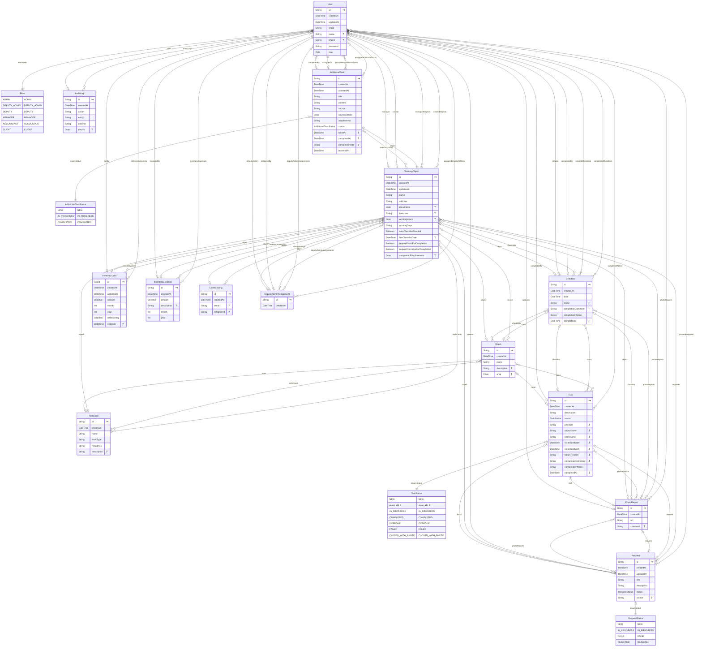

```mermaid
erDiagram

        Role {
            ADMIN ADMIN
DEPUTY_ADMIN DEPUTY_ADMIN
DEPUTY DEPUTY
MANAGER MANAGER
ACCOUNTANT ACCOUNTANT
CLIENT CLIENT
        }
    


        TaskStatus {
            NEW NEW
AVAILABLE AVAILABLE
IN_PROGRESS IN_PROGRESS
COMPLETED COMPLETED
OVERDUE OVERDUE
FAILED FAILED
CLOSED_WITH_PHOTO CLOSED_WITH_PHOTO
        }
    


        RequestStatus {
            NEW NEW
IN_PROGRESS IN_PROGRESS
DONE DONE
REJECTED REJECTED
        }
    


        AdditionalTaskStatus {
            NEW NEW
IN_PROGRESS IN_PROGRESS
COMPLETED COMPLETED
        }
    
  "User" {
    String id "🗝️"
    DateTime createdAt 
    DateTime updatedAt 
    String email 
    String name "❓"
    String phone "❓"
    String password 
    Role role 
    }
  

  "CleaningObject" {
    String id "🗝️"
    DateTime createdAt 
    DateTime updatedAt 
    String name 
    String address 
    Json documents "❓"
    String timezone "❓"
    Json workingHours "❓"
    String workingDays 
    Boolean autoChecklistEnabled 
    DateTime lastChecklistDate "❓"
    Boolean requirePhotoForCompletion 
    Boolean requireCommentForCompletion 
    Json completionRequirements "❓"
    }
  

  "Room" {
    String id "🗝️"
    DateTime createdAt 
    String name 
    String description "❓"
    Float area "❓"
    }
  

  "TechCard" {
    String id "🗝️"
    DateTime createdAt 
    String name 
    String workType 
    String frequency 
    String description "❓"
    }
  

  "Checklist" {
    String id "🗝️"
    DateTime createdAt 
    DateTime date 
    String name "❓"
    String completionComment "❓"
    String completionPhotos 
    DateTime completedAt "❓"
    }
  

  "Task" {
    String id "🗝️"
    DateTime createdAt 
    String description 
    TaskStatus status 
    String photoUrl "❓"
    String objectName "❓"
    String roomName "❓"
    DateTime scheduledStart "❓"
    DateTime scheduledEnd "❓"
    String failureReason "❓"
    String completionComment "❓"
    String completionPhotos 
    DateTime completedAt "❓"
    }
  

  "Request" {
    String id "🗝️"
    DateTime createdAt 
    DateTime updatedAt 
    String title 
    String description 
    RequestStatus status 
    String source "❓"
    }
  

  "InventoryLimit" {
    String id "🗝️"
    DateTime createdAt 
    DateTime updatedAt 
    Decimal amount 
    Int month 
    Int year 
    Boolean isRecurring 
    DateTime endDate "❓"
    }
  

  "InventoryExpense" {
    String id "🗝️"
    DateTime createdAt 
    Decimal amount 
    String description "❓"
    Int month 
    Int year 
    }
  

  "PhotoReport" {
    String id "🗝️"
    DateTime createdAt 
    String url 
    String comment "❓"
    }
  

  "AuditLog" {
    String id "🗝️"
    DateTime createdAt 
    String action 
    String entity 
    String entityId 
    Json details "❓"
    }
  

  "ClientBinding" {
    String id "🗝️"
    DateTime createdAt 
    String email "❓"
    String telegramId "❓"
    }
  

  "AdditionalTask" {
    String id "🗝️"
    DateTime createdAt 
    DateTime updatedAt 
    String title 
    String content 
    String source 
    Json sourceDetails 
    String attachments 
    AdditionalTaskStatus status 
    DateTime takenAt "❓"
    DateTime completedAt "❓"
    String completionNote "❓"
    DateTime receivedAt 
    }
  

  "DeputyAdminAssignment" {
    String id "🗝️"
    DateTime createdAt 
    }
  
    "User" o|--|| "Role" : "enum:role"
    "User" o{--}o "AdditionalTask" : "assignedAdditionalTasks"
    "User" o{--}o "AdditionalTask" : "completedAdditionalTasks"
    "User" o{--}o "AuditLog" : "auditLogs"
    "User" o{--}o "Checklist" : "completedChecklists"
    "User" o{--}o "Checklist" : "createdChecklists"
    "User" o{--}o "CleaningObject" : "createdObjects"
    "User" o{--}o "CleaningObject" : "managedObjects"
    "User" o{--}o "DeputyAdminAssignment" : "assignedDeputyAdmins"
    "User" o{--}o "DeputyAdminAssignment" : "deputyAdminAssignments"
    "User" o{--}o "InventoryExpense" : "inventoryExpenses"
    "User" o{--}o "InventoryLimit" : "setInventoryLimits"
    "User" o{--}o "PhotoReport" : "photoReports"
    "User" o{--}o "Request" : "createdRequests"
    "User" o{--}o "Task" : "completedTasks"
    "CleaningObject" o{--}o "AdditionalTask" : "additionalTasks"
    "CleaningObject" o{--}o "Checklist" : "checklists"
    "CleaningObject" o|--|| "User" : "creator"
    "CleaningObject" o|--|o "User" : "manager"
    "CleaningObject" o{--}o "ClientBinding" : "clientBindings"
    "CleaningObject" o{--}o "DeputyAdminAssignment" : "deputyAdminAssignments"
    "CleaningObject" o{--}o "InventoryExpense" : "inventoryExpenses"
    "CleaningObject" o{--}o "InventoryLimit" : "inventoryLimits"
    "CleaningObject" o{--}o "PhotoReport" : "photoReports"
    "CleaningObject" o{--}o "Request" : "requests"
    "CleaningObject" o{--}o "Room" : "rooms"
    "CleaningObject" o{--}o "TechCard" : "techCards"
    "Room" o{--}o "Checklist" : "checklists"
    "Room" o|--|| "CleaningObject" : "object"
    "Room" o{--}o "Task" : "tasks"
    "Room" o{--}o "TechCard" : "techCards"
    "TechCard" o|--|| "CleaningObject" : "object"
    "TechCard" o|--|o "Room" : "room"
    "Checklist" o|--|o "User" : "completedBy"
    "Checklist" o|--|| "User" : "creator"
    "Checklist" o|--|| "CleaningObject" : "object"
    "Checklist" o|--|o "Room" : "room"
    "Checklist" o{--}o "PhotoReport" : "photoReports"
    "Checklist" o{--}o "Task" : "tasks"
    "Task" o|--|| "TaskStatus" : "enum:status"
    "Task" o{--}o "PhotoReport" : "photoReports"
    "Task" o|--|o "Checklist" : "checklist"
    "Task" o|--|o "User" : "completedBy"
    "Task" o|--|o "Request" : "request"
    "Task" o|--|o "Room" : "room"
    "Request" o|--|| "RequestStatus" : "enum:status"
    "Request" o{--}o "PhotoReport" : "photoReports"
    "Request" o|--|| "User" : "creator"
    "Request" o|--|| "CleaningObject" : "object"
    "Request" o{--}o "Task" : "tasks"
    "InventoryLimit" o|--|| "CleaningObject" : "object"
    "InventoryLimit" o|--|| "User" : "setBy"
    "InventoryExpense" o|--|| "CleaningObject" : "object"
    "InventoryExpense" o|--|| "User" : "recordedBy"
    "PhotoReport" o|--|o "Checklist" : "checklist"
    "PhotoReport" o|--|o "CleaningObject" : "object"
    "PhotoReport" o|--|o "Request" : "request"
    "PhotoReport" o|--|o "Task" : "task"
    "PhotoReport" o|--|| "User" : "uploader"
    "AuditLog" o|--|| "User" : "user"
    "ClientBinding" o|--|| "CleaningObject" : "object"
    "AdditionalTask" o|--|| "AdditionalTaskStatus" : "enum:status"
    "AdditionalTask" o|--|| "User" : "assignedTo"
    "AdditionalTask" o|--|o "User" : "completedBy"
    "AdditionalTask" o|--|| "CleaningObject" : "object"
    "DeputyAdminAssignment" o|--|| "User" : "assignedBy"
    "DeputyAdminAssignment" o|--|| "User" : "deputyAdmin"
    "DeputyAdminAssignment" o|--|| "CleaningObject" : "object"
```
