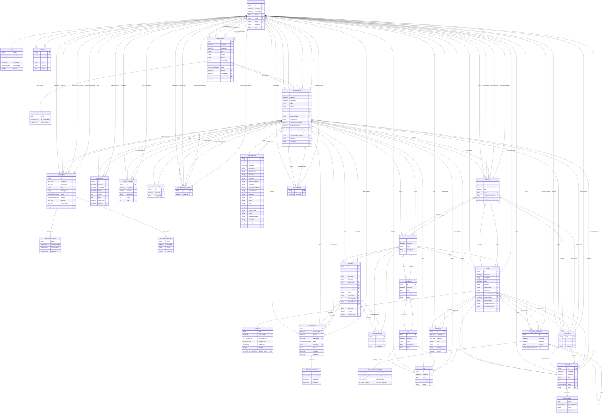

```mermaid
erDiagram

        Role {
            ADMIN ADMIN
DEPUTY_ADMIN DEPUTY_ADMIN
DEPUTY DEPUTY
MANAGER MANAGER
ACCOUNTANT ACCOUNTANT
CLIENT CLIENT
        }
    


        TaskStatus {
            NEW NEW
AVAILABLE AVAILABLE
IN_PROGRESS IN_PROGRESS
COMPLETED COMPLETED
OVERDUE OVERDUE
FAILED FAILED
CLOSED_WITH_PHOTO CLOSED_WITH_PHOTO
        }
    


        RequestStatus {
            NEW NEW
IN_PROGRESS IN_PROGRESS
DONE DONE
REJECTED REJECTED
        }
    


        AdditionalTaskStatus {
            NEW NEW
IN_PROGRESS IN_PROGRESS
COMPLETED COMPLETED
        }
    


        ReportingTaskStatus {
            NEW NEW
IN_PROGRESS IN_PROGRESS
COMPLETED COMPLETED
CANCELLED CANCELLED
        }
    


        ReportingTaskPriority {
            LOW LOW
MEDIUM MEDIUM
HIGH HIGH
URGENT URGENT
        }
    


        TaskExecutionStatus {
            PENDING PENDING
COMPLETED COMPLETED
OVERDUE OVERDUE
SKIPPED SKIPPED
        }
    


        TaskAdminCommentType {
            ADMIN_NOTE ADMIN_NOTE
COMPLETION_FEEDBACK COMPLETION_FEEDBACK
INSTRUCTION INSTRUCTION
QUALITY_CHECK QUALITY_CHECK
        }
    
  "User" {
    String id "🗝️"
    DateTime createdAt 
    DateTime updatedAt 
    String email 
    String name "❓"
    String phone "❓"
    String password 
    Role role 
    }
  

  "CleaningObject" {
    String id "🗝️"
    DateTime createdAt 
    DateTime updatedAt 
    String name 
    String address 
    Json documents "❓"
    String timezone "❓"
    Json workingHours "❓"
    String workingDays 
    Boolean autoChecklistEnabled 
    DateTime lastChecklistDate "❓"
    Boolean requirePhotoForCompletion 
    Boolean requireCommentForCompletion 
    Json completionRequirements "❓"
    Float totalArea "❓"
    String description "❓"
    String notes "❓"
    }
  

  "Room" {
    String id "🗝️"
    DateTime createdAt 
    String name 
    String description "❓"
    Float area "❓"
    }
  

  "Site" {
    String id "🗝️"
    DateTime createdAt 
    String name 
    String description "❓"
    Float area "❓"
    }
  

  "Zone" {
    String id "🗝️"
    DateTime createdAt 
    String name 
    String description "❓"
    Float area "❓"
    }
  

  "RoomGroup" {
    String id "🗝️"
    DateTime createdAt 
    String name 
    String description "❓"
    Float area "❓"
    }
  

  "CleaningObjectItem" {
    String id "🗝️"
    DateTime createdAt 
    String name 
    String description "❓"
    }
  

  "TechCard" {
    String id "🗝️"
    DateTime createdAt 
    String name 
    String workType 
    String frequency 
    String description "❓"
    String period "❓"
    String seasonality "❓"
    String notes "❓"
    String workDetails "❓"
    Int frequencyDays "❓"
    String preferredTime "❓"
    Int maxDelayHours "❓"
    String timeSlots 
    Boolean isActive 
    Boolean autoGenerate 
    }
  

  "Checklist" {
    String id "🗝️"
    DateTime createdAt 
    DateTime date 
    String name "❓"
    String completionComment "❓"
    String completionPhotos 
    DateTime completedAt "❓"
    }
  

  "Task" {
    String id "🗝️"
    DateTime createdAt 
    String description 
    TaskStatus status 
    String photoUrl "❓"
    String objectName "❓"
    String roomName "❓"
    DateTime scheduledStart "❓"
    DateTime scheduledEnd "❓"
    String failureReason "❓"
    String completionComment "❓"
    String completionPhotos 
    DateTime completedAt "❓"
    }
  

  "Request" {
    String id "🗝️"
    DateTime createdAt 
    DateTime updatedAt 
    String title 
    String description 
    RequestStatus status 
    String source "❓"
    }
  

  "InventoryLimit" {
    String id "🗝️"
    DateTime createdAt 
    DateTime updatedAt 
    Decimal amount 
    Int month 
    Int year 
    Boolean isRecurring 
    DateTime endDate "❓"
    }
  

  "InventoryExpense" {
    String id "🗝️"
    DateTime createdAt 
    Decimal amount 
    String description "❓"
    Int month 
    Int year 
    }
  

  "PhotoReport" {
    String id "🗝️"
    DateTime createdAt 
    String url 
    String comment "❓"
    }
  

  "AuditLog" {
    String id "🗝️"
    DateTime createdAt 
    String action 
    String entity 
    String entityId 
    Json details "❓"
    }
  

  "ClientBinding" {
    String id "🗝️"
    DateTime createdAt 
    String telegramId 
    }
  

  "AdditionalTask" {
    String id "🗝️"
    DateTime createdAt 
    DateTime updatedAt 
    String title 
    String content 
    String source 
    Json sourceDetails 
    String attachments 
    AdditionalTaskStatus status 
    DateTime takenAt "❓"
    DateTime completedAt "❓"
    String completionNote "❓"
    DateTime receivedAt 
    }
  

  "DeputyAdminAssignment" {
    String id "🗝️"
    DateTime createdAt 
    }
  

  "ObjectStructure" {
    String id "🗝️"
    DateTime createdAt 
    DateTime updatedAt 
    String objectName 
    String objectAddress "❓"
    String siteName "❓"
    String zoneName "❓"
    String roomGroupName "❓"
    String roomName "❓"
    String cleaningObjectName "❓"
    String techCardName 
    String frequency 
    String notes "❓"
    String period "❓"
    String siteId "❓"
    String zoneId "❓"
    String roomGroupId "❓"
    String roomId "❓"
    String cleaningObjectId "❓"
    String techCardId 
    String workType "❓"
    String description "❓"
    }
  

  "ReportingTask" {
    String id "🗝️"
    DateTime createdAt 
    DateTime updatedAt 
    String title 
    String description "❓"
    ReportingTaskStatus status 
    ReportingTaskPriority priority 
    DateTime dueDate "❓"
    DateTime completedAt "❓"
    String completionComment "❓"
    }
  

  "ExcludedObject" {
    String id "🗝️"
    DateTime excludedAt 
    }
  

  "TaskExecution" {
    String id "🗝️"
    DateTime scheduledFor 
    DateTime dueDate 
    DateTime executedAt "❓"
    TaskExecutionStatus status 
    String comment "❓"
    String photos 
    DateTime createdAt 
    DateTime updatedAt 
    }
  

  "task_admin_comments" {
    String id "🗝️"
    DateTime createdAt 
    DateTime updatedAt 
    String content 
    TaskAdminCommentType type 
    }
  

  "notifications" {
    String id "🗝️"
    DateTime createdAt 
    DateTime updatedAt 
    String type 
    String title 
    String message 
    Boolean isRead 
    }
  
    "User" o|--|| "Role" : "enum:role"
    "User" o{--}o "AdditionalTask" : "assignedAdditionalTasks"
    "User" o{--}o "AdditionalTask" : "completedAdditionalTasks"
    "User" o{--}o "AuditLog" : "auditLogs"
    "User" o{--}o "Checklist" : "completedChecklists"
    "User" o{--}o "Checklist" : "createdChecklists"
    "User" o{--}o "CleaningObject" : "createdObjects"
    "User" o{--}o "CleaningObject" : "managedObjects"
    "User" o{--}o "DeputyAdminAssignment" : "assignedDeputyAdmins"
    "User" o{--}o "DeputyAdminAssignment" : "deputyAdminAssignments"
    "User" o{--}o "InventoryExpense" : "inventoryExpenses"
    "User" o{--}o "InventoryLimit" : "setInventoryLimits"
    "User" o{--}o "PhotoReport" : "photoReports"
    "User" o{--}o "Request" : "createdRequests"
    "User" o{--}o "Task" : "completedTasks"
    "User" o{--}o "Site" : "managedSites"
    "User" o{--}o "TaskExecution" : "taskExecutions"
    "User" o{--}o "ReportingTask" : "createdReportingTasks"
    "User" o{--}o "ReportingTask" : "assignedReportingTasks"
    "User" o{--}o "ExcludedObject" : "excludedObjects"
    "User" o{--}o "task_admin_comments" : "adminComments"
    "User" o{--}o "notifications" : "notifications"
    "CleaningObject" o{--}o "AdditionalTask" : "additionalTasks"
    "CleaningObject" o{--}o "Checklist" : "checklists"
    "CleaningObject" o|--|| "User" : "creator"
    "CleaningObject" o|--|o "User" : "manager"
    "CleaningObject" o{--}o "ClientBinding" : "clientBindings"
    "CleaningObject" o{--}o "DeputyAdminAssignment" : "deputyAdminAssignments"
    "CleaningObject" o{--}o "InventoryExpense" : "inventoryExpenses"
    "CleaningObject" o{--}o "InventoryLimit" : "inventoryLimits"
    "CleaningObject" o{--}o "PhotoReport" : "photoReports"
    "CleaningObject" o{--}o "Request" : "requests"
    "CleaningObject" o{--}o "Room" : "rooms"
    "CleaningObject" o{--}o "TechCard" : "techCards"
    "CleaningObject" o{--}o "Site" : "sites"
    "CleaningObject" o{--}o "ObjectStructure" : "objectStructures"
    "CleaningObject" o{--}o "TaskExecution" : "taskExecutions"
    "CleaningObject" o{--}o "ReportingTask" : "reportingTasks"
    "CleaningObject" o{--}o "ExcludedObject" : "excludedObjects"
    "Room" o{--}o "Checklist" : "checklists"
    "Room" o|--|| "CleaningObject" : "object"
    "Room" o|--|o "RoomGroup" : "roomGroup"
    "Room" o{--}o "Task" : "tasks"
    "Room" o{--}o "TechCard" : "techCards"
    "Room" o{--}o "CleaningObjectItem" : "cleaningObjects"
    "Site" o|--|| "CleaningObject" : "object"
    "Site" o|--|o "User" : "manager"
    "Site" o{--}o "Zone" : "zones"
    "Zone" o|--|| "Site" : "site"
    "Zone" o{--}o "RoomGroup" : "roomGroups"
    "RoomGroup" o|--|| "Zone" : "zone"
    "RoomGroup" o{--}o "Room" : "rooms"
    "CleaningObjectItem" o|--|| "Room" : "room"
    "CleaningObjectItem" o{--}o "TechCard" : "techCards"
    "TechCard" o|--|| "CleaningObject" : "object"
    "TechCard" o|--|o "Room" : "room"
    "TechCard" o|--|o "CleaningObjectItem" : "cleaningObjectItem"
    "TechCard" o{--}o "TaskExecution" : "executions"
    "Checklist" o|--|o "User" : "completedBy"
    "Checklist" o|--|| "User" : "creator"
    "Checklist" o|--|| "CleaningObject" : "object"
    "Checklist" o|--|o "Room" : "room"
    "Checklist" o{--}o "PhotoReport" : "photoReports"
    "Checklist" o{--}o "Task" : "tasks"
    "Task" o|--|| "TaskStatus" : "enum:status"
    "Task" o{--}o "PhotoReport" : "photoReports"
    "Task" o|--|o "Checklist" : "checklist"
    "Task" o|--|o "User" : "completedBy"
    "Task" o|--|o "Request" : "request"
    "Task" o|--|o "Room" : "room"
    "Task" o{--}o "task_admin_comments" : "adminComments"
    "Task" o{--}o "notifications" : "notifications"
    "Request" o|--|| "RequestStatus" : "enum:status"
    "Request" o{--}o "PhotoReport" : "photoReports"
    "Request" o|--|| "User" : "creator"
    "Request" o|--|| "CleaningObject" : "object"
    "Request" o{--}o "Task" : "tasks"
    "InventoryLimit" o|--|| "CleaningObject" : "object"
    "InventoryLimit" o|--|| "User" : "setBy"
    "InventoryExpense" o|--|| "CleaningObject" : "object"
    "InventoryExpense" o|--|| "User" : "recordedBy"
    "PhotoReport" o|--|o "Checklist" : "checklist"
    "PhotoReport" o|--|o "CleaningObject" : "object"
    "PhotoReport" o|--|o "Request" : "request"
    "PhotoReport" o|--|o "Task" : "task"
    "PhotoReport" o|--|| "User" : "uploader"
    "AuditLog" o|--|| "User" : "user"
    "ClientBinding" o|--|| "CleaningObject" : "object"
    "AdditionalTask" o|--|| "AdditionalTaskStatus" : "enum:status"
    "AdditionalTask" o|--|| "User" : "assignedTo"
    "AdditionalTask" o|--|o "User" : "completedBy"
    "AdditionalTask" o|--|| "CleaningObject" : "object"
    "DeputyAdminAssignment" o|--|| "User" : "assignedBy"
    "DeputyAdminAssignment" o|--|| "User" : "deputyAdmin"
    "DeputyAdminAssignment" o|--|| "CleaningObject" : "object"
    "ObjectStructure" o|--|| "CleaningObject" : "object"
    "ReportingTask" o|--|| "ReportingTaskStatus" : "enum:status"
    "ReportingTask" o|--|| "ReportingTaskPriority" : "enum:priority"
    "ReportingTask" o|--|| "CleaningObject" : "object"
    "ReportingTask" o|--|| "User" : "createdBy"
    "ReportingTask" o|--|| "User" : "assignedTo"
    "ExcludedObject" o|--|| "CleaningObject" : "object"
    "ExcludedObject" o|--|| "User" : "excludedBy"
    "TaskExecution" o|--|| "TechCard" : "techCard"
    "TaskExecution" o|--|| "CleaningObject" : "object"
    "TaskExecution" o|--|| "User" : "manager"
    "TaskExecution" o|--|| "TaskExecutionStatus" : "enum:status"
    "task_admin_comments" o|--|| "TaskAdminCommentType" : "enum:type"
    "task_admin_comments" o|--|| "Task" : "task"
    "task_admin_comments" o|--|| "User" : "admin"
    "task_admin_comments" o|--|o "task_admin_comments" : "parentComment"
    "task_admin_comments" o{--}o "task_admin_comments" : "replies"
    "notifications" o|--|| "User" : "user"
    "notifications" o|--|o "Task" : "relatedTask"
```
